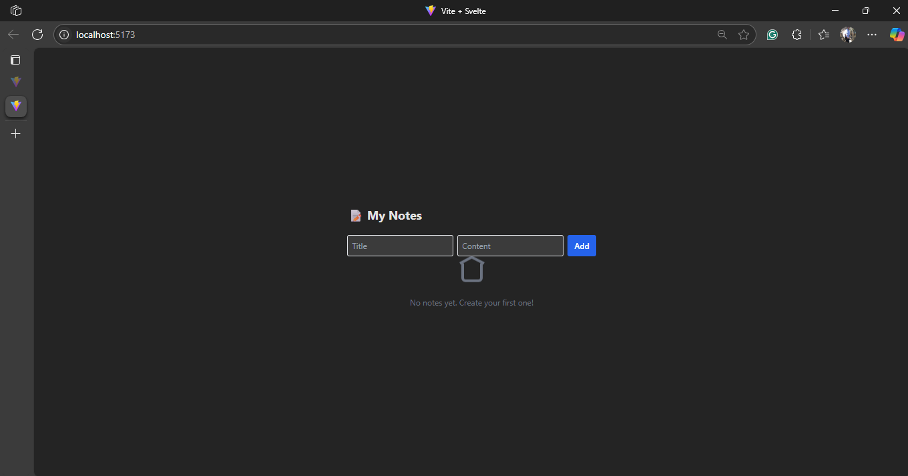
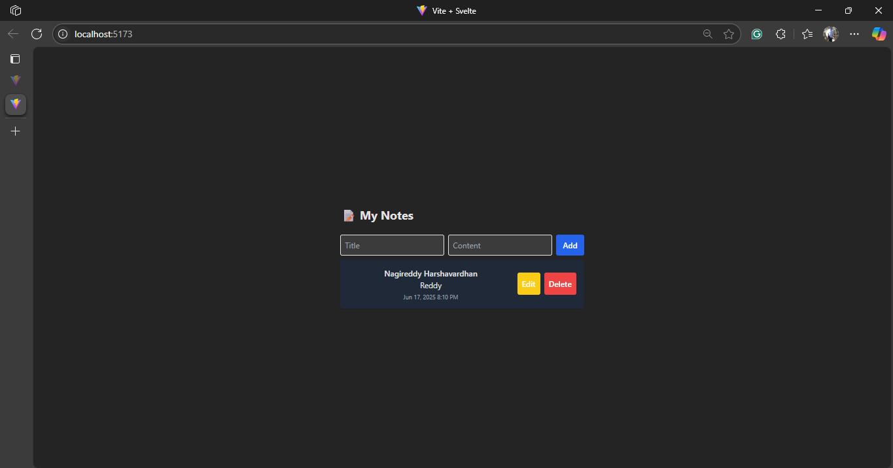
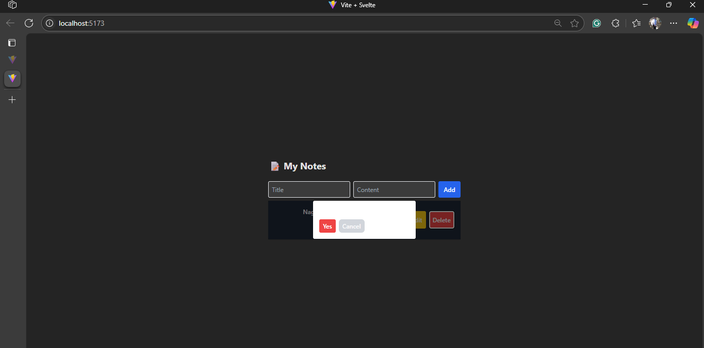

# 🧪 Svelte + Tailwind Notes CRUD App

## 🚀 How to Run

1. Clone the repo:
    ```
    git clone https://github.com/yourusername/svelte-notes.git
    cd svelte-notes
    ```
2. Install dependencies:
    ```
    npm install
    ```

3. Run dev server:
    ```
    npm run dev
    ```
4. Open [http://localhost:5173](http://localhost:5173) in your browser.

## 🚧 Assumptions / Tradeoffs

- Used [MockAPI](https://mockapi.io/) for notes data, endpoint: `https://your.mockapi.io/notes`
- No authentication, just straight CRUD actions
- UI only, no backend code included
- Svelte 5 and Tailwind 4 used for latest best practices

## 📸 Screenshots

| browser page after clicking the link | entering the details | Deleting |
|--------------|----------|-----------|
|  |  |  |

---

## 💡 Improvements with More Time

- Add dark mode and delete confirmation modals
- Add list search/pagination, spinner/loading feedback
- Polish for accessibility (a11y) and mobile experience
- Write unit and e2e tests

## 🔗 API Setup

You can use MockAPI as shown [here](https://mockapi.io/):
- Resource: `/notes` with `id`, `title`, `content`, `createdAt`

If you want to run locally, use [json-server](https://github.com/typicode/json-server) and set a matching REST endpoint URL.
